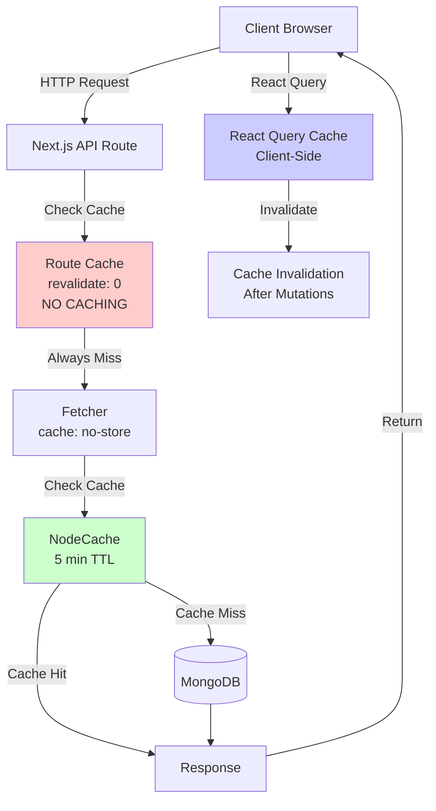

# API Caching Guide

## Overview

This codebase uses multiple layers of caching:



## Caching Architecture
1. **Next.js Route Cache** - Server-side route caching
2. **NodeCache** - In-memory server-side cache (5-minute TTL)
3. **React Query** - Client-side data fetching and caching
4. **Next.js Fetch Cache** - HTTP fetch caching

## Where APIs Are Located

All API routes are in the `src/app/api/` directory:

```
src/app/api/
├── account/              # Account management
│   ├── route.ts         # Create/update accounts
│   ├── member/          # Member-specific endpoints
│   ├── vendor/          # Vendor endpoints
│   ├── loan/            # Loan endpoints
│   ├── offset/           # Offset adjustments
│   └── select/           # Account selection
├── admin/                # Admin operations
│   ├── recalculate/      # Recalculate all transactions
│   ├── dashboard/recalculate/  # Recalculate dashboard
│   ├── backup/           # Data backup
│   └── members/[id]/     # Member management
├── auth/                 # Authentication
│   ├── login/
│   ├── logout/
│   ├── status/
│   └── me/
├── dashboard/            # Dashboard data
│   ├── summary/          # Summary data
│   ├── club-passbook/    # Club passbook data
│   └── graphs/           # Analytics graphs
├── transaction/          # Transaction management
│   ├── route.ts          # List transactions
│   ├── create/           # Create transaction
│   └── [id]/             # Get/update/delete transaction
├── profile/              # User profile
├── search/               # Global search
└── upload/               # File uploads
```

## Caching Layers

### 1. Next.js Route Cache (Server-Side)

**Location**: All API route files (`src/app/api/**/route.ts`)

**Configuration**:
```typescript
export const dynamic = "force-dynamic";  // Disable static generation
export const revalidate = 0;              // Never cache (0 = no cache)
export const fetchCache = "force-no-store"; // Don't cache fetch requests
```

**Current Status**: 
- **ALL API routes are configured with NO CACHING** (`revalidate: 0`, `fetchCache: "force-no-store"`)
- This means every API request hits the database directly
- No route-level caching is active

**Files with this config** (29 API routes):
- All routes in `src/app/api/**/route.ts`

### 2. NodeCache (In-Memory Server Cache)

**Location**: `src/lib/core/cache.ts`

**Configuration**:
```typescript
stdTTL: 300,        // 5 minutes time-to-live
checkperiod: 60,    // Check for expired keys every minute
```

**Usage**:
- Used internally by some helper functions
- Can be cleared with `clearCache()` function
- Cleared automatically when:
  - Recalculating transactions (`resetAllTransactionMiddlewareHandler`)
  - Creating backups (`/api/admin/backup`)

**When to Clear**:
- After bulk data operations
- After recalculations
- After major data changes

### 3. React Query (Client-Side Cache)

**Location**: `src/lib/query-options.ts` and components using `useQuery`

**Configuration**:
```typescript
const noRefetchConfigs = {
  refetchOnMount: false,      // Don't refetch when component mounts
  refetchInactive: true,      // Refetch when query becomes active
  refetchOnReconnect: true,   // Refetch on network reconnect
  refetchOnWindowFocus: false, // Don't refetch on window focus
};
```

**Query Keys Structure**:
```typescript
["authentication"]                    // Auth status
["all", "transaction", options]       // Transactions
["dashboard", "summary", month]       // Dashboard summary
["dashboard", "club-passbook"]        // Club passbook
["all", "statistic"]                  // Statistics
["account", "member", username]       // Member details
```

**Cache Invalidation**:
```typescript
// Invalidate specific queries
queryClient.invalidateQueries({ queryKey: ["dashboard", "summary"] });

// Invalidate all queries with prefix
queryClient.invalidateQueries({ queryKey: ["all"] });

// Invalidate all dashboard queries
queryClient.invalidateQueries({ queryKey: ["dashboard"] });
```

### 4. Next.js Fetch Cache

**Location**: `src/lib/core/fetcher.ts`

**Configuration**:
```typescript
fetch(path, {
  next: { revalidate: 0 },    // Never cache
  cache: "no-store",          // Don't store in cache
});
```

**Current Status**: All fetches are configured to NOT cache

## When to Reset/Invalidate Cache

### 1. After Data Mutations (Client-Side)

**React Query Invalidation** - After mutations, invalidate related queries:

```typescript
// Example: After creating a transaction
onSuccess: () => {
  queryClient.invalidateQueries({ queryKey: ["all", "transaction"] });
  queryClient.invalidateQueries({ queryKey: ["dashboard"] });
}
```

**Common Invalidation Patterns**:

| Action | Queries to Invalidate |
|--------|----------------------|
| Create/Update/Delete Transaction | `["all", "transaction"]`, `["dashboard"]` |
| Create/Update Account | `["all"]`, `["account"]` |
| Recalculate Returns | `["all"]` |
| Recalculate Dashboard | `["dashboard"]`, `["all", "statistic"]` |
| Update Member Access | `["account", "member"]` |
| Create Offset | `["dashboard"]`, `["account"]` |

### 2. After Server-Side Operations

**Next.js Cache Revalidation** - In API routes after mutations:

```typescript
import { revalidatePath, revalidateTag } from "next/cache";

// Revalidate all paths
revalidatePath("*");

// Revalidate specific tag
revalidateTag("api");
```

**Current Usage**:
- `/api/admin/recalculate` - Revalidates all paths and "api" tag
- `/api/account/route.ts` - Revalidates all paths and "api" tag after account creation
- `/api/account/offset/route.ts` - Revalidates all paths and "api" tag after offset
- `/api/transaction/[id]/route.ts` - Revalidates all paths after transaction update/delete

### 3. NodeCache Clearing

**When to Clear**:
- After bulk recalculations (`resetAllTransactionMiddlewareHandler`)
- After data backups
- When you want to force fresh data from database

**How to Clear**:
```typescript
import { clearCache } from "@/lib/core/cache";
clearCache();
```

## Current Caching Strategy

### Summary

**Server-Side (Next.js)**:
- ❌ **NO ROUTE CACHING** - All routes use `revalidate: 0` and `fetchCache: "force-no-store"`
- ✅ **NodeCache** - 5-minute TTL for internal operations
- ✅ **Manual Revalidation** - After mutations using `revalidatePath()` and `revalidateTag()`

**Client-Side (React Query)**:
- ✅ **Query Caching** - Active with smart invalidation
- ✅ **Selective Refetching** - Only refetches when needed
- ✅ **Manual Invalidation** - After mutations

### Why No Route Caching?

All API routes are configured with no caching because:
1. **Financial Data Accuracy** - Financial data must always be fresh
2. **Real-time Updates** - Users need to see latest transactions immediately
3. **Data Integrity** - Prevents showing stale financial information

## Best Practices

### 1. Always Invalidate After Mutations

```typescript
// ✅ Good - Invalidate related queries
const mutation = useMutation({
  mutationFn: createTransaction,
  onSuccess: () => {
    queryClient.invalidateQueries({ queryKey: ["all", "transaction"] });
    queryClient.invalidateQueries({ queryKey: ["dashboard"] });
  }
});
```

### 2. Use Specific Query Keys

```typescript
// ✅ Good - Specific key
queryClient.invalidateQueries({ queryKey: ["dashboard", "summary"] });

// ⚠️ Use with caution - Invalidates too much
queryClient.invalidateQueries({ queryKey: ["all"] });
```

### 3. Revalidate Server Cache After Mutations

```typescript
// ✅ Good - In API route after mutation
revalidatePath("*");
revalidateTag("api");
```

### 4. Clear NodeCache for Bulk Operations

```typescript
// ✅ Good - Clear cache before bulk operations
clearCache();
await resetAllTransactionMiddlewareHandler();
```

## Common Cache Invalidation Patterns

### Pattern 1: Transaction Operations

```typescript
// After create/update/delete transaction
queryClient.invalidateQueries({ queryKey: ["all", "transaction"] });
queryClient.invalidateQueries({ queryKey: ["dashboard"] });
revalidatePath("*");
```

### Pattern 2: Account Operations

```typescript
// After create/update account
queryClient.invalidateQueries({ queryKey: ["all"] });
queryClient.invalidateQueries({ queryKey: ["account"] });
revalidatePath("*");
revalidateTag("api");
```

### Pattern 3: Recalculation Operations

```typescript
// After recalculating transactions
clearCache();
queryClient.invalidateQueries({ queryKey: ["all"] });
revalidatePath("*");
revalidateTag("api");
```

## Debugging Cache Issues

### Check React Query Cache

```typescript
// In browser console
window.__REACT_QUERY_STATE__ // View cached queries
```

### Check Server Cache

```typescript
// In API route
import cache from "@/lib/core/cache";
const stats = cache.getStats();
console.log("Cache stats:", stats);
```

### Force Refresh

```typescript
// Client-side
queryClient.invalidateQueries(); // Invalidate all
queryClient.refetchQueries();    // Refetch all

// Server-side
revalidatePath("*");
clearCache();
```

## Recommendations

### Current State
- ✅ Client-side caching (React Query) is well implemented
- ✅ Cache invalidation is properly handled after mutations
- ❌ Server-side route caching is disabled (by design for financial data)

### If You Need to Enable Route Caching

**⚠️ Only for non-financial data endpoints**:

```typescript
// Example: For read-only, non-critical data
export const revalidate = 60; // Cache for 60 seconds
export const fetchCache = "force-cache";
```

**Never enable caching for**:
- Transaction endpoints
- Dashboard endpoints
- Account balance endpoints
- Financial calculation endpoints

## Quick Reference: When to Reset Cache

| Scenario | Client-Side (React Query) | Server-Side (Next.js) | NodeCache |
|----------|---------------------------|----------------------|-----------|
| **Create Transaction** | `invalidateQueries(["all", "transaction"])`<br/>`invalidateQueries(["dashboard"])` | `revalidatePath("*")` | Not needed |
| **Update Transaction** | `invalidateQueries(["all", "transaction"])`<br/>`invalidateQueries(["dashboard"])` | `revalidatePath("*")` | Not needed |
| **Delete Transaction** | `invalidateQueries(["all", "transaction"])`<br/>`invalidateQueries(["dashboard"])` | `revalidatePath("*")` | Not needed |
| **Create/Update Account** | `invalidateQueries(["all"])`<br/>`invalidateQueries(["account"])` | `revalidatePath("*")`<br/>`revalidateTag("api")` | Not needed |
| **Create Offset** | `invalidateQueries(["dashboard"])`<br/>`invalidateQueries(["account"])` | `revalidatePath("*")`<br/>`revalidateTag("api")` | Not needed |
| **Recalculate Returns** | `invalidateQueries(["all"])` | `revalidatePath("*")`<br/>`revalidateTag("api")` | `clearCache()` |
| **Recalculate Dashboard** | `invalidateQueries(["dashboard"])`<br/>`invalidateQueries(["all", "statistic"])` | Not needed | Not needed |
| **Backup Data** | Not needed | `revalidateTag("api")` | `clearCache()` |
| **Update Member Access** | `invalidateQueries(["account", "member"])` | Not needed | Not needed |

## Summary

1. **API Routes**: Located in `src/app/api/` - all configured with NO caching
2. **Client Cache**: React Query handles client-side caching with smart invalidation
3. **Server Cache**: NodeCache (5-min TTL) for internal operations
4. **When to Reset**: After any data mutation, recalculation, or bulk operation
5. **How to Reset**: Use `queryClient.invalidateQueries()` (client) and `revalidatePath()` (server)

## Key Takeaways

- ✅ **All API routes have NO route-level caching** (by design for financial accuracy)
- ✅ **React Query provides client-side caching** with automatic background refetching
- ✅ **Always invalidate cache after mutations** to keep UI in sync
- ✅ **Use specific query keys** for targeted invalidation
- ✅ **Clear NodeCache** only for bulk operations or recalculations

